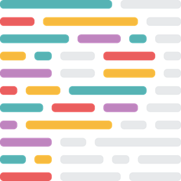

# Fav-Note

## Tools

<ul>
  <li>ESlint  </li>
  <li>Prettier  </li>
  <li>Husky </li>
  <li>VS Code  </li>
  <li>Git  </li>
  <li>Github  </li>
  <li>Styled Components  </li>
  <li>Storybook  </li>
</ul>

## Good practices

- Atomic Design
